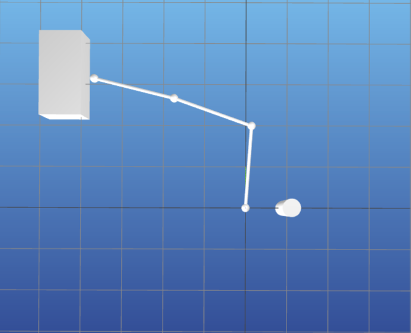
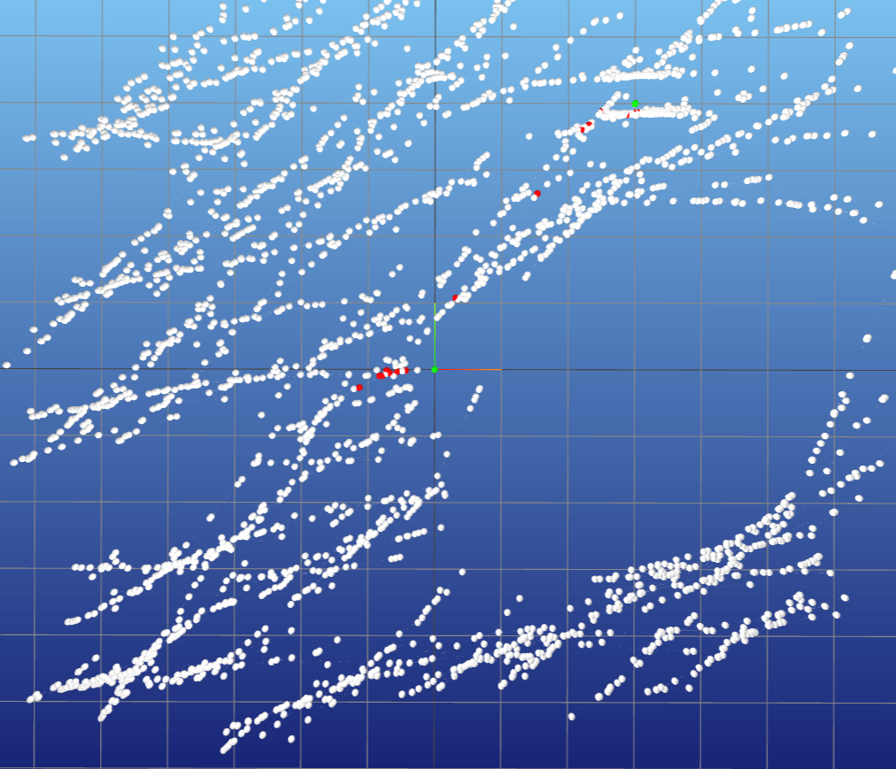

# 1. Env:  
** Visu robot arm three joints in XY-plane**  

```
python3 arm_vis.py cfg/arm_env_0.yaml cfg/arm_plan_0.yaml
```

<div align="center">
  
</div>

# Example:   
**2. RRT motion planning for robot arm from start to goal configuration in C-space with collision checking :**  

**Start RRT**
```
python3 rrt.py cfg/arm_0.yaml arm_plan_0.yaml
```

**Visualize tree and path**
```
 python3 solutionRRT.py tree_rrt.yaml cfg/arm_0.yaml

```

**Verify that all configs are collision free**
```
 python3 solutionRRT.py tree_rrt.yaml cfg/arm_0.yaml

```


<div align="center">
  
</div>


<div align="center">
  
</div>


** Visu car kinodynamic motion planning**  


<div align="center">
  
</div>


<div align="center">
  
</div>
