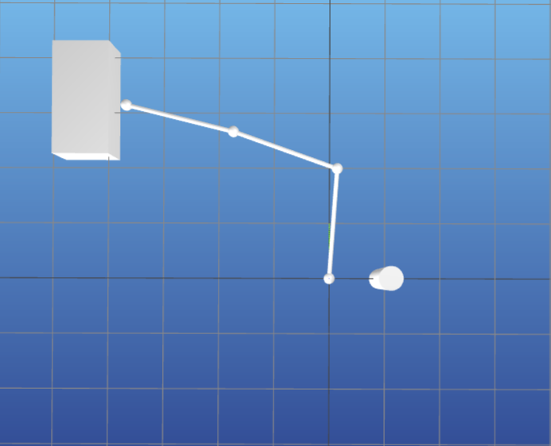
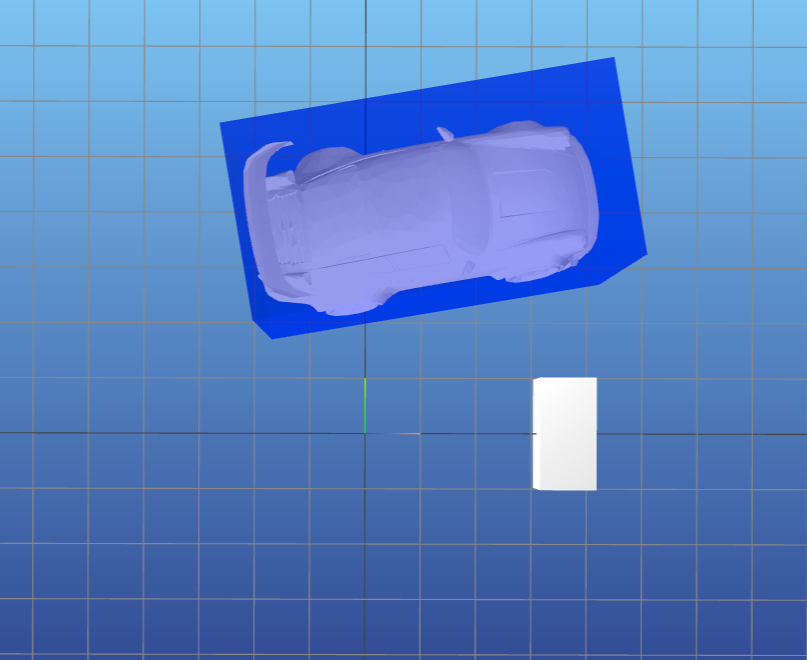
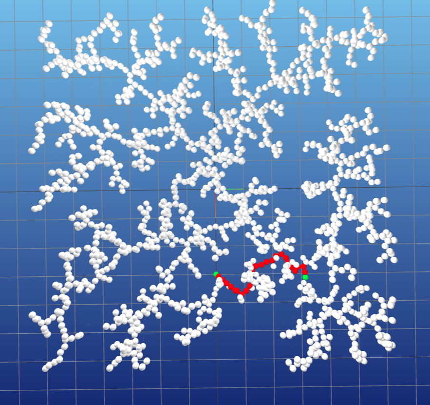
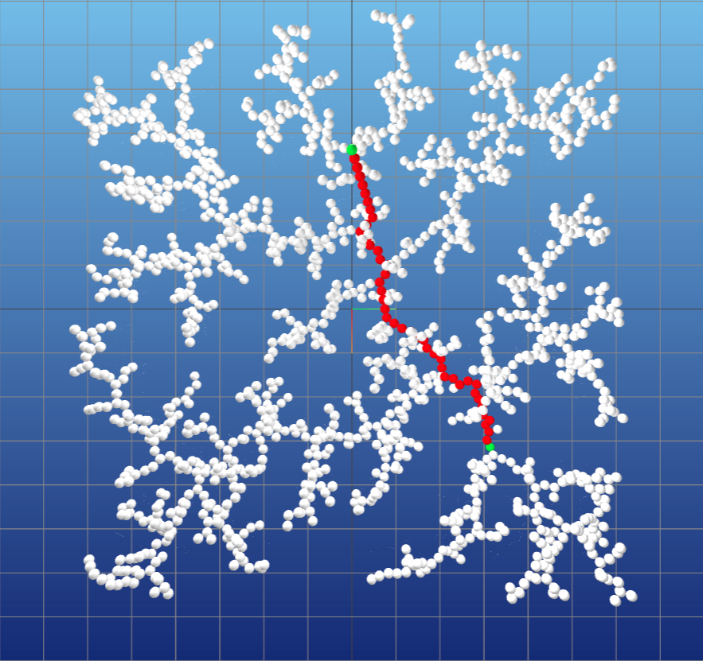
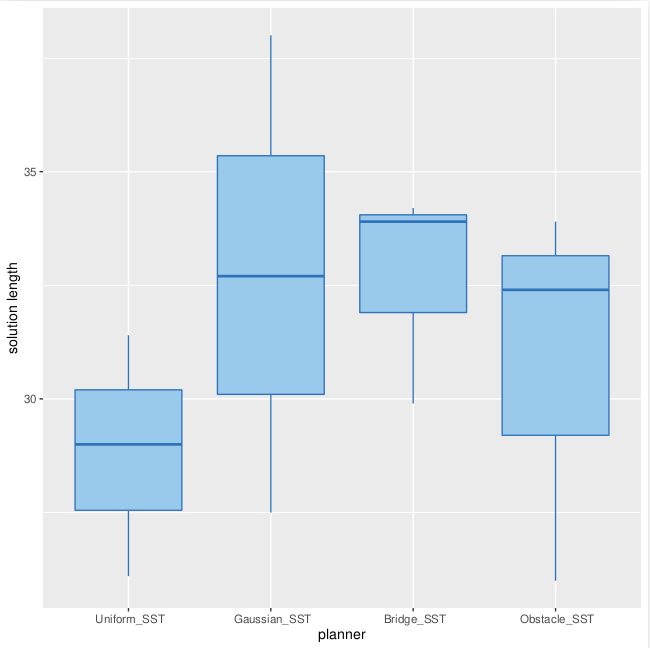
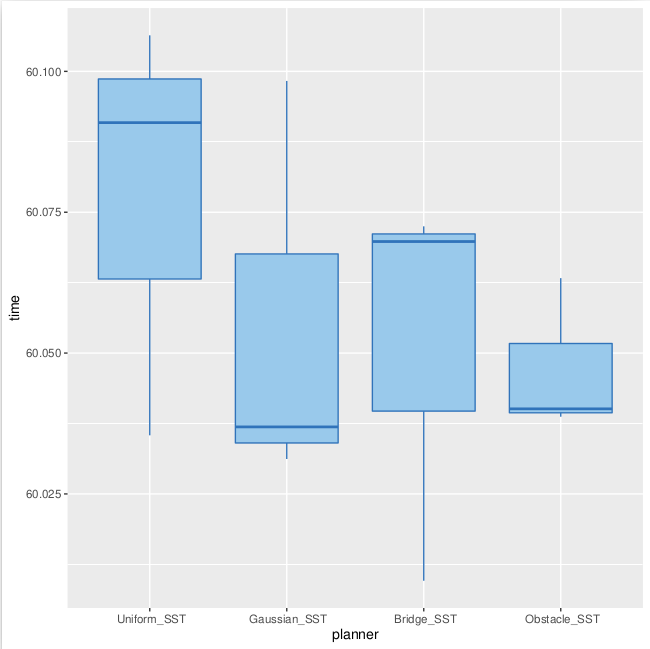
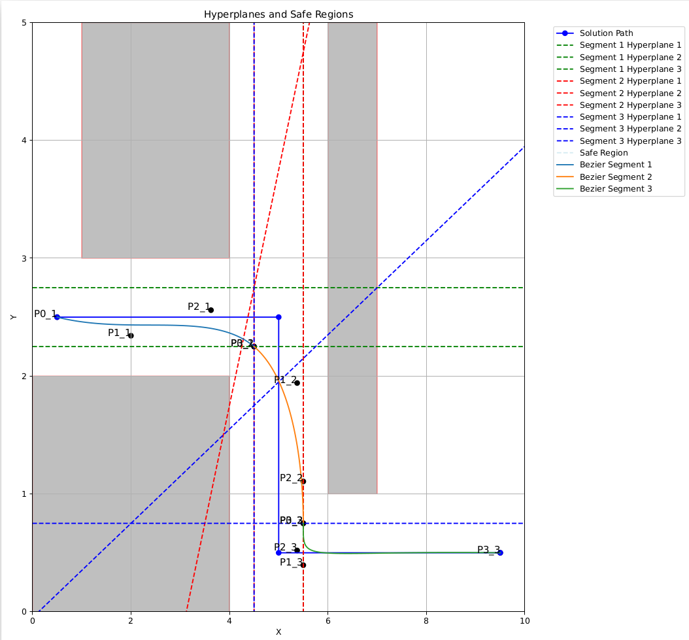
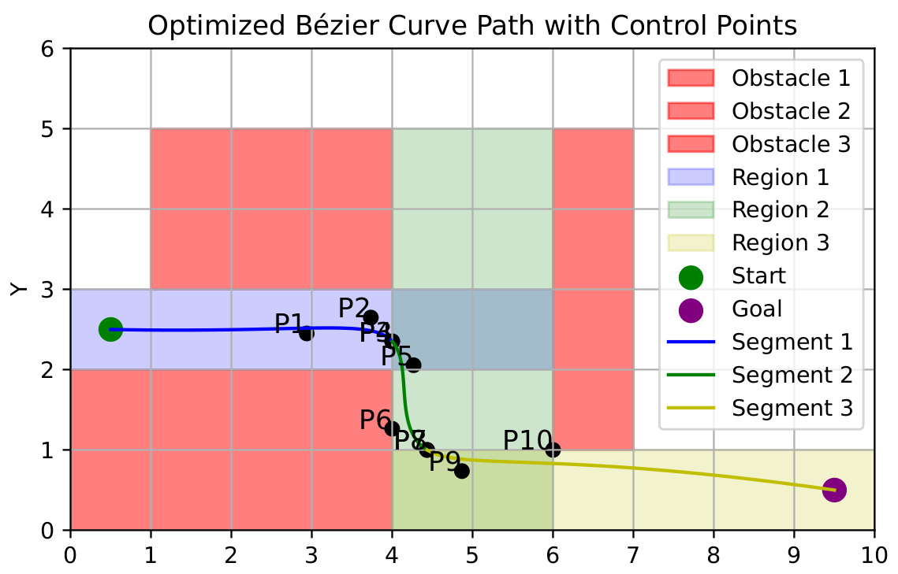

# Overview


# 1. FCL Libary collision checking

- 3 joint manipulator
- kinodynamic car

```
python3 arm_vis.py cfg/arm_env_0.yaml cfg/arm_plan_0.yaml
```

```
python3 car_vis.py cfg/car_env_0.yaml cfg/car_plan_0.yaml
```

```
python3 collision.py cfg/car_env_0.yaml cfg/car_plan_0.yaml output.yaml
```

<div align="center">
  
</div>


<div align="center">
  
</div>


# 2. RRT, Nearest neighbour, Tree Search

- Geometric planning RRT manipulator:

```
python3 rrt.py cfg/arm_0.yaml arm_plan_0.yaml
```

<div align="center">
  
</div>


<div align="center">
  
</div>


- Kinodynamic planning RRT car:


<div align="center">
  
</div>


# 3. OMPL, benchmark planner, Sampling (Gaussian, Bridge, Uniform, Obstacle)

```
docker run --rm -v ${PWD}:/home/ompl -P kavrakilab/omplapp python3 script.py
```

```
python3 ompl_planner.py cfg/arm_0.yaml arm_plan_0.yaml
```

```
python3 ompl_planner.py cfg/car_0.yaml car_plan_0.yaml
```

```
python3 ompl_benchmark.py cfg/car_1.yaml car_1.log
```

<div align="center">
  
</div>


<div align="center">
  
</div>


# 4. SVM, Bezier Curves, Differential flatness, Optimization (cvxpy)

```
python3 opt_safe.py cfg/bezier_0.yaml bezier_0.pdf
```

```
python3 opt_safe.py cfg/bezier_0.yaml bezier_0.pdf --export-car bezier_car_plan_0.yaml
```


```
python3 opt_safe.py cfg/bezier_0.yaml bezier_0.pdf --export-arm bezier_arm_plan_0.yaml
```


<div align="center">
  
</div>


<div align="center">
  
</div>


